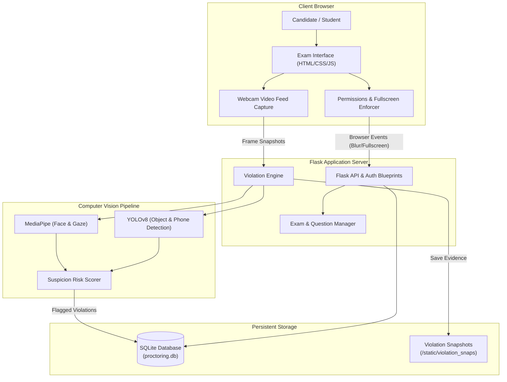

# 🎓 AI-Powered Online Exam Proctoring System

An intelligent, real-time automated proctoring platform designed to ensure academic integrity during online assessments using Computer Vision and Deep Learning.

Built with **Python**, **Flask**, **MediaPipe**, **OpenCV**, and **YOLOv8**, this system monitors test-takers in real-time, automatically flags suspicious behaviors, logs photo evidence of violations, and provides comprehensive analytics for educators and administrators.

---

## 📌 Table of Contents
- [Key Features](#-key-features)
- [System Architecture](#-system-architecture)
- [Detection Modules & Violation Engine](#-detection-modules--violation-engine)
- [Tech Stack](#-tech-stack)
- [Repository Structure](#-repository-structure)
- [Getting Started](#-getting-started)
  - [Prerequisites](#prerequisites)
  - [Installation](#installation)
  - [Database Initialization & Setup](#database-initialization--setup)
  - [Running the Application](#running-the-application)
- [Violation Severity & Risk Scoring](#-violation-severity--risk-scoring)
- [Workflow](#-workflow)
- [Author & Credits](#-author--credits)

---

## 🚀 Key Features

### 1. 🤖 Real-Time AI Proctoring
* **Face Presence & Absence Detection**: Continuously verifies candidate presence; flags when a candidate leaves the frame.
* **Multiple Faces Detection**: Instantly flags if another individual enters the camera frame.
* **Gaze & Head Pose Tracking**: Detects candidates looking away from the screen (left, right, or downward) repeatedly.
* **Mobile Phone Detection**: Powered by **YOLOv8** object detection model to detect smartphones or handheld devices.
* **Secondary Person / Accomplice Detection**: Detects extra individuals in the room even if their face is partially obscured.

### 2. 🛡️ Client-Side Integrity & Environment Lockdown
* **Mandatory Permissions Pre-Check**: Pre-flight system check verifying webcam access and browser compatibility.
* **Strict Fullscreen Lock**: Enforces full-screen mode during the exam; escaping full-screen is logged as a violation.
* **Tab Switch & Blur Protection**: Triggers immediate cutoff or penalty if the candidate switches tabs or minimizes the exam window.
* **Automated Evidence Snapshots**: Automatically captures and timestamps webcam snapshots whenever a violation occurs.

### 3. 👥 Role-Based Portals

#### 🎓 Student Portal
* Simple registration and login.
* Student Dashboard showing available exams and past attempt scores.
* Interactive, timer-enabled exam interface with real-time video feedback.

#### 🛠️ Administrator Dashboard
* **Exam Management**: Create exams, assign custom exam codes, and manage question banks.
* **Student Overview**: Inspect candidate attempt records, completion status, and scores.
* **Risk Score & Audit Trail**: Real-time calculated risk scores based on violation weightage.
* **Violation Evidence Gallery**: Browse timestamped violation logs complete with captured webcam snapshots.

---

## 🏗️ System Architecture



---

## 🧠 Detection Modules & Violation Engine

The AI pipeline is encapsulated in the `proctor_ai/` module:

| Module | Purpose | Technology |
| :--- | :--- | :--- |
| `face_module.py` | Detects face counts (0, 1, or multiple) | MediaPipe Face Mesh / Detection |
| `gaze_module.py` | Tracks iris position relative to eye corners (left/right/center) | MediaPipe Face Mesh |
| `headpose_module.py` | Estimates head orientation (yaw, pitch, roll) | 3D Landmark Estimation |
| `phone_module.py` | Detects mobile phones in the webcam stream | Ultralytics YOLOv8n |
| `person_module.py` | Detects presence of additional persons in frame | YOLOv8n COCO Person Class |
| `suspicion_score.py` | Computes dynamic suspicion index per frame | Custom weighted formula |
| `violation_engine.py` | Orchestrates all detectors and returns aggregated flags | Modular Python Engine |

---

## 💻 Tech Stack

* **Language**: Python 3.9+
* **Web Framework**: Flask, Jinja2 Templates
* **Database**: SQLite3
* **Computer Vision**: OpenCV (`cv2`), MediaPipe
* **Deep Learning**: Ultralytics YOLOv8 (`yolov8n.pt`)
* **Numerical Computing**: NumPy
* **Report Generation**: ReportLab
* **Frontend**: HTML5, CSS3, JavaScript (Webcam API, Fullscreen API)

---

## 📂 Repository Structure

```plaintext
exam_proctoring/
│
├── README.md                      # Project documentation and guide
│
└── backend/
    ├── app.py                     # Main Flask server and route handlers
    ├── auth.py                    # Student authentication blueprint
    ├── admin.py                   # Administrator controllers
    ├── create_admin.py            # Utility script to generate default admin user
    ├── database.py                # Database connection, schemas, and migrations
    ├── exam_manager.py            # Question fetching, answer evaluation, score logic
    ├── report_generator.py        # PDF report generator for exam attempts
    ├── requirements.txt           # Python package dependencies
    ├── yolov8n.pt                 # YOLOv8 pre-trained weights for object detection
    │
    ├── proctor_ai/                # Computer vision and AI modules
    │   ├── face_module.py         # Face presence and count detection
    │   ├── gaze_module.py         # Eye gaze tracking
    │   ├── headpose_module.py     # Head pose estimation
    │   ├── person_module.py       # Extra person detector
    │   ├── phone_module.py        # Smartphone detector
    │   ├── suspicion_score.py     # Weighted score calculator
    │   └── violation_engine.py    # Pipeline coordinator
    │
    ├── static/                    # Frontend static assets
    │   ├── css/                   # Stylesheets
    │   ├── js/                    # JavaScript logic & webcam handlers
    │   └── violation_snaps/       # Captured violation snapshot evidence
    │
    └── templates/                 # Jinja2 HTML templates
        ├── admin_dashboard.html   # Admin monitoring & exams control panel
        ├── admin_login.html       # Administrator login page
        ├── admin_student_detail.html # Deep-dive into a student's attempts & evidence
        ├── dashboard.html         # General dashboard
        ├── exam.html              # Candidate exam interface with proctoring
        ├── login.html             # Unified login portal
        ├── permissions_check.html # System pre-check (camera/fullscreen)
        ├── register.html          # Student registration page
        ├── result.html            # Post-exam test summary
        ├── student_dashboard.html # Student portal for starting tests
        └── student_login.html     # Student login view
```

---

## ⚡ Getting Started

### Prerequisites
* **Python**: Version 3.9, 3.10, or 3.11 installed
* **Webcam**: A functional webcam connected to your computer
* **Git**: Installed on your system

### Installation

1. **Clone the repository:**
   ```bash
   git clone https://github.com/euginjoy007/exam_proctoring.git
   cd exam_proctoring
   ```

2. **Navigate to the backend directory:**
   ```bash
   cd backend
   ```

3. **Create and activate a virtual environment (recommended):**
   * **Windows (PowerShell):**
     ```powershell
     python -m venv venv
     .\venv\Scripts\Activate.ps1
     ```
   * **Linux / macOS:**
     ```bash
     python3 -m venv venv
     source venv/bin/activate
     ```

4. **Install the dependencies:**
   ```bash
   pip install -r requirements.txt
   ```

---

### Database Initialization & Setup

Initialize the SQLite database schema and create an administrator account:

1. **Create the admin account:**
   ```bash
   python create_admin.py
   ```
   *(This ensures you have admin credentials to access the proctor management panel).*

---

### Running the Application

Start the Flask development server:

```bash
python app.py
```

By default, the application runs at:
```
http://127.0.0.1:5000
```

* **Student Portal**: `http://127.0.0.1:5000/student-login`
* **Admin Portal**: `http://127.0.0.1:5000/admin-login`

---

## ⚖️ Violation Severity & Risk Scoring

The system computes an aggregate **Risk Score** for each student to highlight high-risk candidates to administrators:

| Violation Event | Severity Points | Trigger Condition |
| :--- | :---: | :--- |
| **Phone Detected** (`phone_detected`) | `30` | Smartphone visible in camera feed |
| **External Person Detected** (`external_person_detected`) | `30` | Accompanier / extra body detected in frame |
| **Multiple Faces** (`multiple_faces`) | `25` | More than 1 face detected simultaneously |
| **Camera / Fullscreen Denied** (`permissions_blocked` / `fullscreen_exit`) | `20` | Fullscreen exited or permissions manipulated |
| **No Face Detected** (`no_face`) | `15` | Candidate leaves camera view (> 5s) |
| **Audio Anomaly** (`audio_noise`) | `10` | Abnormal background conversation or noise |
| **Gaze Deviation** (`gaze_left`, `gaze_right`, `gaze_away`) | `5` | Looking away from the exam screen repeatedly |

---

## 🔄 Workflow

1. **Admin Setup**: Admin logs in, registers a new exam with an exam code, and configures questions.
2. **Pre-Exam Verification**: Student logs in, selects the exam, and undergoes a hardware check (camera feed + fullscreen lock).
3. **Assessment & Active Proctoring**:
   - As the candidate answers questions, background threads periodically sample camera frames.
   - The AI pipeline verifies face presence, gaze angles, and scans for prohibited objects (mobile phones).
   - Any detected anomaly triggers a logged violation with a timestamp and screenshot.
4. **Submission & Review**:
   - The student completes the exam and receives their score.
   - Admin reviews the candidate's attempt history, overall risk score, and full evidence log on the admin dashboard.

---

## 👤 Author & Credits

* **Author:** [Eugin Joy](https://github.com/euginjoy007)
* **GitHub:** [@euginjoy007](https://github.com/euginjoy007)
* **Project Repository:** [exam_proctoring](https://github.com/euginjoy007/exam_proctoring)
